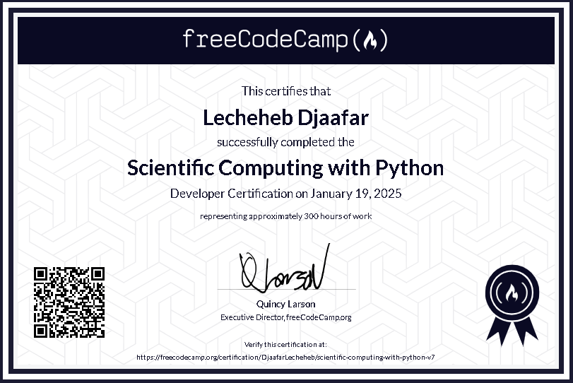

# FreeCodeCamp : Scientific-Computing-with-Python

## نظرة عامة
هذه المشاريع الخمسة مصممة لتعزيز مهارات البرمجة في Python مع التركيز على الحوسبة العلمية. كل مشروع يركز على مفاهيم مختلفة في البرمجة كائنية التوجه والتعامل مع البيانات.

## المشاريع

### 1. منسق العمليات الحسابية (Arithmetic Formatter)
- **الوصف**: برنامج لتنسيق المسائل الحسابية بشكل عمودي
- **المهارات**: 
  - معالجة النصوص
  - تنسيق المخرجات
  - التعامل مع القوائم

### 2. حاسبة الوقت (Time Calculator)
- **الوصف**: دالة لإضافة فترات زمنية إلى وقت معين
- **المهارات**:
  - معالجة الوقت والتاريخ
  - العمليات الحسابية
  - تنسيق المخرجات

### 3. تطبيق الميزانية (Budget App)
- **الوصف**: نظام لتتبع الميزانية في فئات مختلفة
- **المهارات**:
  - البرمجة كائنية التوجه
  - إدارة البيانات
  - تتبع المعاملات المالية

### 4. حاسبة مساحة المضلعات (Polygon Area Calculator)
- **الوصف**: برنامج لحساب مساحة المستطيلات والمربعات
- **المهارات**:
  - الوراثة في البرمجة كائنية التوجه
  - الحسابات الهندسية
  - التمثيل البصري للأشكال

### 5. حاسبة الاحتمالات (Probability Calculator)
- **الوصف**: محاكاة لحساب احتمالات سحب كرات من قبعة
- **المهارات**:
  - المحاكاة الإحصائية
  - العمليات العشوائية
  - حساب الاحتمالات

## المهارات المكتسبة
- البرمجة كائنية التوجه
- معالجة البيانات
- التفكير المنطقي والرياضي
- حل المشكلات البرمجية
- كتابة اختبارات الوحدة
- تنظيم وهيكلة الكود

## متطلبات عامة
- معرفة أساسية بلغة Python
- فهم المفاهيم الأساسية للبرمجة
- القدرة على قراءة وفهم التوثيق
- مهارات أساسية في التفكير المنطقي والرياضي

## موارد مفيدة
- توثيق Python الرسمي
- مجتمعات المبرمجين عبر الإنترنت
- منصات التعلم الإلكتروني
- مكتبات Python العلمية
# الشهادة التي تحصل عليها:

